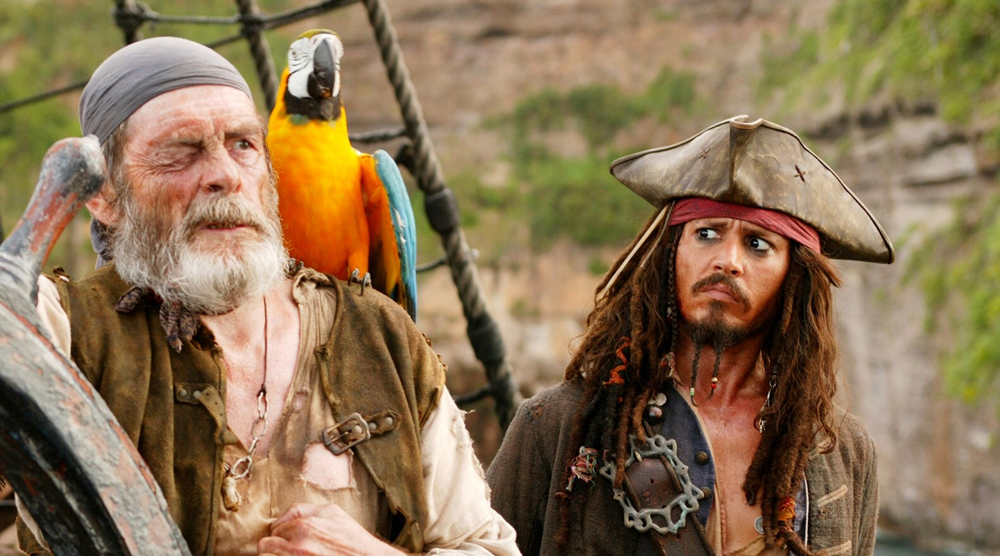

# 🏴‍☠️ Captain Jack Sparrow - Premium Web Experience

A highly interactive, premium front-end web application themed around the legendary Captain Jack Sparrow and the *Pirates of the Caribbean* franchise. This project was built to deliver a "Next-Level" user experience with smooth animations, custom interactions, and a fully functional frontend e-commerce interface.

## ✨ Features

- **Premium Animations:** Built with GSAP and ScrollTrigger for buttery smooth parallax scrolling, fade-ins, and scroll-reveal effects.
- **Interactive AI Chatbot:** A custom-built chatbot widget that lets users converse with Captain Jack Sparrow himself.
- **Captain's Stash E-Commerce Store:** A fully functional frontend store featuring:
  - Slide-out interactive Cart sidebar.
  - Dynamic total calculation and item management.
  - A responsive Checkout modal with mock payment processing.
- **Immersive UI/UX:** Features a custom Pirate-themed mouse cursor, dynamic hover states, and a premium dark-gold color palette.
- **Responsive Layouts:** Built with CSS Grid and Flexbox to ensure a seamless experience across devices.

## 🛠️ Technologies Used

- **HTML5** - Semantic structure
- **CSS3** - Vanilla CSS, Custom Properties (Variables), Flexbox, CSS Grid
- **JavaScript (Vanilla)** - DOM manipulation, Cart logic, Chatbot logic
- **GSAP (GreenSock)** - Advanced scroll animations and transitions

## 🚀 How to Run

Since this is a static frontend project, no complex server setup is required. 
1. Clone the repository: `git clone https://github.com/your-username/jack-sparrow-site.git`
2. Open the project folder.
3. Simply double-click `index.html` to open it in your favorite web browser.

---
*"Not all treasure is silver and gold, mate."*
